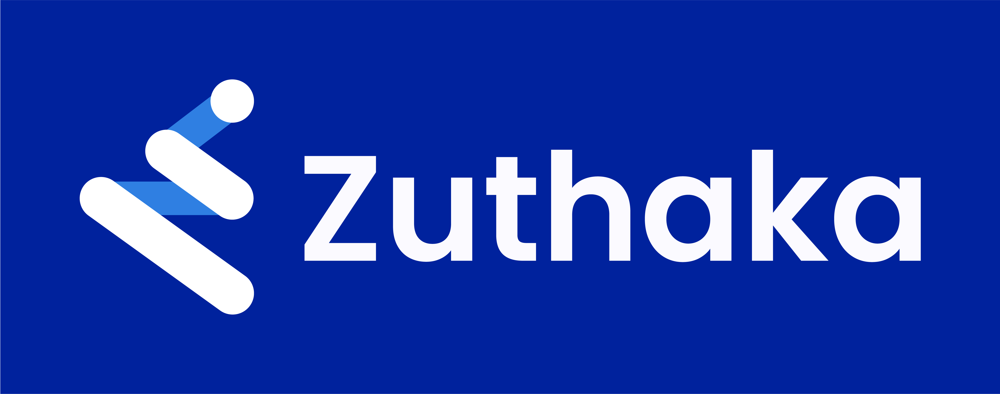

<!-- PROJECT SHIELDS -->

[![Contributors][contributors-shield]][contributors-url]
[![Forks][forks-shield]][forks-url]
[![Stargazers][stars-shield]][stars-url]
[![Issues][issues-shield]][issues-url]
[![MIT License][license-shield]][license-url]
[![LinkedIn][linkedin-shield]][linkedin-url]

<!-- PROJECT LOGO -->
 

  <a href="https://github.com/pucarasec/zuthaka">
    

  <h3 align="center">Zuthaka</h3>

  

  An universal C2 integration tool with a strong computer control interface. With the capability of reutilizing listeners, launching and post-exploitation modules of the integration targets 
    <a href="https://docs.zuthaka.com"><strong>Explore the docs »</strong></a>
     
     
    <a href="https://demo.zuthaka.com">View Demo</a>
    ·
    <a href="https://github.com/pucarasec/zuthaka/issues">Report Bug</a>
    ·
    <a href="https://github.com/pucarasec/zuthaka/issues">Request Feature</a>
  

<!-- TABLE OF CONTENTS -->
## Table of Contents

* [About the Project](#about-the-project)
  * [Feature](#features)
  * [Built With](#built-with)
* [Getting Started](#getting-started)
  * [Prerequisites](#prerequisites)
  * [Installation](#installation)
* [Usage](#usage)
* [Roadmap](#roadmap)
* [Contributing](#contributing)
* [License](#license)
* [Contact](#contact)
* [Acknowledgements](#acknowledgements)

<!-- ABOUT THE PROJECT -->
## About The Project
Zuthaka is an open-source application designed to assist red-teaming efforts, by simplifying the task of managing different APTs and other post-exploitation tools. It will feature a front end that will show the common features of every tool, together with a list of the current owned assets and its properties, and a backend that will have different adaptors that will connect to each APT. The front end will also feature a user-friendly way of creating each implant, simplifying in a unified way the deployment of new red-teaming assessments.

[![Product Name Screen Shot][product-screenshot]](https://zuthaka.com)

### Features 

* A user-friendly frontend with a gentle learning curve.
* Agents
* Multi-User
* Multi-Tennant
* Privilege segmentation for users
* API Conecters
* Cross-platform with easy implementation
* Protocols of communication :  HTTP(DNS,DoH, FTP, IMAP, MAPI, SMB)
* Key Enchange – one of the following ( RSA, AES , TLS )
* Easy implementation of domain fronting
* Custom Profiles
* Jitter – set the agent to sleep for the particular interval,
* Working Hours  - list the current agent workinghours, or set working hours (24hour format)
* Kill Date – when agent is no longer available
* Chaining  
* Logging

### First Integrations

* [Covenant](https://github.com/cobbr/Covenant)
* [Empire](https://github.com/BC-SECURITY/Empire)

### Built With

* [Django Rest Framework](https://www.django-rest-framework.org/)
* [ReactJS](https://reactjs.org)
* [Docker](https://www.docker.com/)
* [PostgreSQL](https://www.postgresql.org//)

<!-- GETTING STARTED -->
## Getting Started

TBA

### Prerequisites

TBA

### Installation

TBA

<!-- USAGE EXAMPLES -->
## Usage

TBA

<!-- ROADMAP -->
## Roadmap

TBA

<!-- CONTRIBUTING -->
## Contributing

TBA

<!-- LICENSE -->
## License

TBA

<!-- CONTACT -->
## Contact

Your Name - [@pucarasec](https://twitter.com/pucarasec) - contact@pucarasec.com

Project Link: [https://github.com/pucarasec/zuthaka](https://github.com/your_username/repo_name)

<!-- ACKNOWLEDGEMENTS -->
## Acknowledgements

TBA

<!-- MARKDOWN LINKS & IMAGES -->
<!-- https://www.markdownguide.org/basic-syntax/#reference-style-links -->
[contributors-shield]: https://img.shields.io/github/contributors/othneildrew/Best-README-Template.svg?style=flat-square
[contributors-url]: https://github.com/othneildrew/Best-README-Template/graphs/contributors
[forks-shield]: https://img.shields.io/github/forks/othneildrew/Best-README-Template.svg?style=flat-square
[forks-url]: https://github.com/othneildrew/Best-README-Template/network/members
[stars-shield]: https://img.shields.io/github/stars/othneildrew/Best-README-Template.svg?style=flat-square
[stars-url]: https://github.com/othneildrew/Best-README-Template/stargazers
[issues-shield]: https://img.shields.io/github/issues/othneildrew/Best-README-Template.svg?style=flat-square
[issues-url]: https://github.com/othneildrew/Best-README-Template/issues
[license-shield]: https://img.shields.io/github/license/othneildrew/Best-README-Template.svg?style=flat-square
[license-url]: https://github.com/othneildrew/Best-README-Template/blob/master/LICENSE.txt
[linkedin-shield]: https://img.shields.io/badge/-LinkedIn-black.svg?style=flat-square&logo=linkedin&colorB=555
[linkedin-url]: https://linkedin.com/pucarasec/
[product-screenshot]: img/zuthaka-flowdiagram.png
